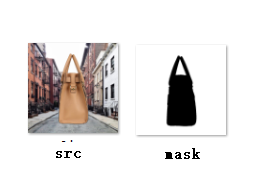
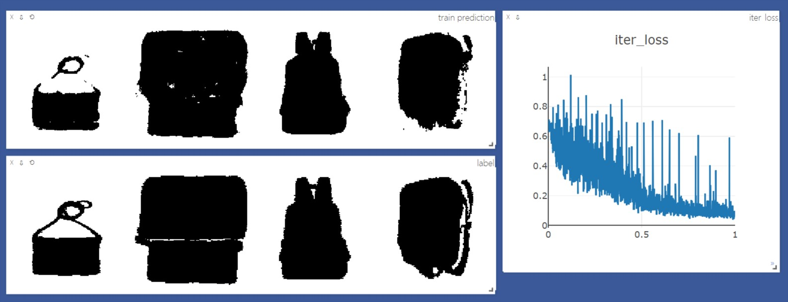

# pytorch FCN easiest demo


这个repo是在读论文[Fully Convolutional Networks for Semantic Segmentation](http://arxiv.org/abs/1411.4038)时的一个pytorch简单复现，数据集很小，是一些随机背景上的一些包的图片（所有数据集大小一共不到80M），如下图



> 关于此数据集详细信息，见[数据集](#数据集)

根据论文实现了FCN32s、FCN16s、FCN8s和FCNs

>部分代码参考了[这个repo](https://github.com/wkentaro/pytorch-fcn)

使用visdom可视化，运行了20个epoch后的可视化如下图：





## 如何运行

### 我的运行环境

* Windows 10
* CUDA 9.2 （可选）
* Anaconda 3
* pytorch = 0.4.1
* torchvision = 0.2.1
* visdom = 0.1.8.5

### 具体操作

* 打开终端，输入
```sh
python -m visdom.server
```
* 打开另一终端，输入
```sh
python train.py
```
* 若没有问题可以打开浏览器输入`http://localhost:8097/`来使用`visdom`可视化

### 训练细节


## 数据集

* training data来自[这里](https://github.com/yunlongdong/FCN-pytorch-easiest/tree/master/last)，ground-truth来自[这里](https://github.com/yunlongdong/FCN-pytorch-easiest/tree/master/last_msk)。
* 链接中提供的图片中，部分ground-truth的有误，而且部分有ground-truth的图片没有对应training data的图片，将这些有错误的图片分别剔除，重新编号排序之后剩余533张图片。
* 之后我随机选取了67张图片**旋转180度**，一共在training data和ground-truth分别凑够600张图片（0.jpg ~ 599.jpg）。

## 可视化

* train prediction：训练时模型的输出
* label：ground-truth
* test prediction：预测时模型的输出（每次训练都会预测，但预测数据不参与训练与backprop）
* train iter loss：训练时每一批（batch）的loss情况
* test iter loss：测试时每一批（batch）的loss情况